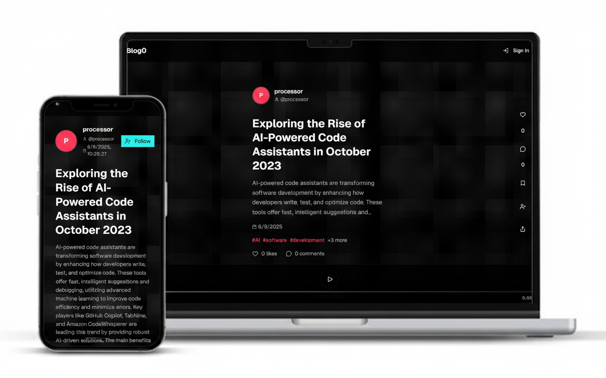
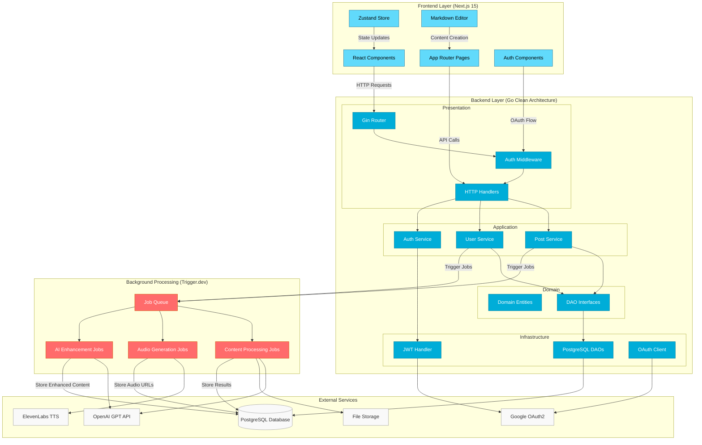
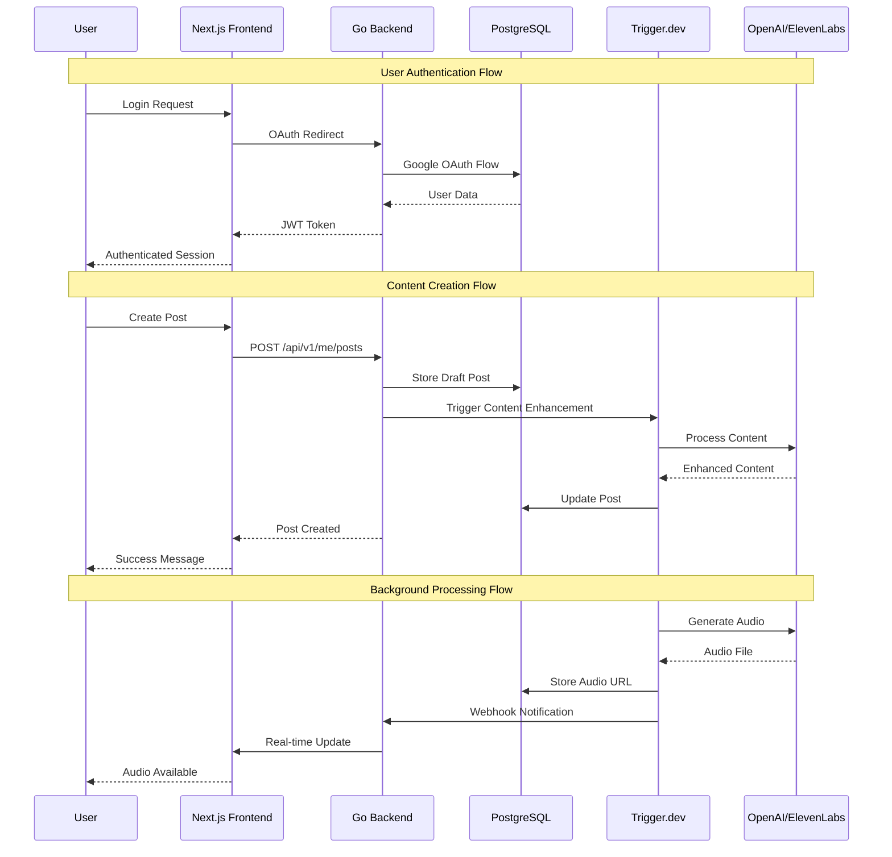

<p align="center">
  
  <h2 align="center">blog0</h2>
<p>A modern, full-stack blog platform with AI-powered content processing, built with clean architecture principles and modern web technologies.</p>
</p>


[](https://golang.org) [](https://nextjs.org) [](LICENSE) [](https://typescriptlang.org) [](https://postgresql.org)


## Architecture Overview

Blog0 is a comprehensive blogging platform consisting of three main components:

- **Backend** - Go REST API with clean architecture
- **UI** - Next.js 15 frontend application
- **Processor** - Background job processing with Trigger.dev



## Detailed Architecture Flow



## Features

### Core Functionality
- **User Authentication** - Google OAuth2 integration with JWT tokens
- **Content Management** - Create, edit, and publish blog posts with Markdown support
- **Social Features** - Comments, likes, bookmarks, and user following
- **Rich Media** - Image uploads and audio generation for posts

### AI-Powered Features
- **Content Enhancement** - AI-powered content suggestions and improvements
- **Audio Generation** - Text-to-speech conversion using ElevenLabs
- **Background Processing** - Asynchronous job processing for heavy tasks

### Technical Features
- **Clean Architecture** - Separation of concerns with domain-driven design
- **Type Safety** - Full TypeScript support across frontend and processing layers
- **API Documentation** - Swagger/OpenAPI documentation
- **Database Migrations** - Version-controlled schema changes
- **Real-time Updates** - Modern React patterns with server components

## Technology Stack

### Backend (Go)
- **Framework**: Gin web framework
- **Database**: PostgreSQL with database/sql
- **Authentication**: Google OAuth2 + JWT
- **Documentation**: Swagger/OpenAPI
- **Architecture**: Clean Architecture with DDD principles

### Frontend (Next.js)
- **Framework**: Next.js 15 with App Router
- **UI**: React 19 with Radix UI primitives
- **Styling**: Tailwind CSS v4
- **State**: Zustand for client state
- **Markdown**: Rich markdown editor with syntax highlighting

### Background Processing
- **Platform**: Trigger.dev for job orchestration
- **Runtime**: Bun for fast JavaScript execution
- **AI Integration**: OpenAI GPT models
- **Audio**: ElevenLabs text-to-speech
- **Database**: Drizzle ORM with PostgreSQL

## API Documentation

When the backend server is running, interactive API documentation is available at:
```
http://localhost:8080/api/swagger/index.html
```

## Architecture Principles

### Backend (Clean Architecture)
- **Domain Layer**: Entities, value objects, and business rules
- **Application Layer**: Use cases and application services
- **Infrastructure Layer**: Database, HTTP handlers, external services
- **Dependency Rule**: Dependencies point inward toward the domain

### Frontend (Component Architecture)
- **Pages**: App Router pages with server components
- **Components**: Reusable UI components with proper separation
- **State**: Client state with Zustand, server state with React Query patterns
- **Styling**: Utility-first CSS with Tailwind and design system components

### Processing (Job Architecture)
- **Jobs**: Discrete, idempotent background tasks
- **Triggers**: Event-driven job execution
- **Error Handling**: Retry logic and failure notifications
- **Monitoring**: Job status tracking and observability

## Security

- JWT token validation for API authentication
- CORS configuration for cross-origin requests
- SQL injection prevention with parameterized queries
- Input validation and sanitization
- OAuth2 secure authentication flow

## Performance

- Database connection pooling
- Efficient database queries with proper indexing
- Image optimization and lazy loading
- Code splitting and bundle optimization
- Background job processing for heavy operations

## Links

- [Backend Documentation](./backend/README.md)
- [Frontend Documentation](./ui/README.md)
- [Processor Documentation](./processor/README.md)