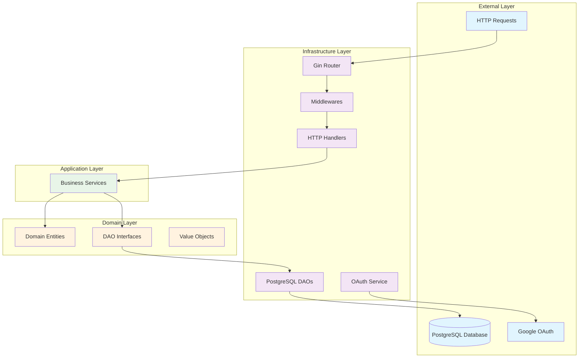

# Blog Backend

A Go-based REST API backend for a blog application built with clean architecture principles, featuring user authentication, post management, comments, likes, and bookmarks.

## Architecture

This application follows Clean Architecture principles with clear separation of concerns:



## Features

### Authentication & Authorization
- Google OAuth2 integration
- JWT token-based authentication
- User session management
- Protected routes with middleware

### Post Management
- Create posts (draft or published)
- Update existing posts
- Delete posts with ownership validation
- List posts with pagination and ordering
- Get post details with comments and metadata
- List user's own posts

### Social Features
- Comment system with reply support
- Like/unlike posts with toggle functionality
- Bookmark/unbookmark posts
- Author information with post statistics

### Technical Features
- RESTful API design
- Swagger/OpenAPI documentation
- Database transactions
- Error handling and validation
- CORS support
- Structured logging

## Project Structure

```
backend/
├── cmd/                    # Application entrypoints
├── config/                 # Configuration management
├── internal/
│   ├── domain/            # Domain layer (entities, interfaces)
│   │   ├── dao/           # Data access interfaces
│   │   └── *.go          # Domain entities
│   ├── services/          # Application services (business logic)
│   └── infra/            # Infrastructure layer
│       ├── handlers/      # HTTP handlers
│       ├── middlewares/   # HTTP middlewares
│       ├── persistence/   # Data persistence implementations
│       │   └── postgres/  # PostgreSQL implementations
│       └── services/      # Infrastructure services
└── server/               # Server setup and routing
```

## Layer Patterns

### Domain Layer
- **Entities**: Rich domain objects with business logic and validation
- **Value Objects**: Immutable objects representing domain concepts
- **DAO Interfaces**: Abstract data access contracts
- **Factory Functions**: Constructor functions with validation
- **Domain Services**: Complex business logic that doesn't belong to entities

**Patterns Used:**
- Repository Pattern (DAO interfaces)
- Factory Pattern (entity constructors)
- Domain-Driven Design principles
- Dependency Inversion (interfaces over implementations)

### Application Layer (Services)
- **Business Logic**: Core application use cases
- **Request/Response DTOs**: Input/output data structures
- **Service Orchestration**: Coordination between multiple DAOs
- **Transaction Management**: Database transaction boundaries

**Patterns Used:**
- Service Layer Pattern
- DTO Pattern
- Command Pattern (service requests)
- Facade Pattern (service interfaces)

### Infrastructure Layer

#### HTTP Handlers
- **Request Parsing**: URL params, query params, JSON body parsing
- **Authentication**: JWT token validation and user context
- **Response Formatting**: Consistent JSON responses
- **Error Handling**: HTTP status code mapping

**Patterns Used:**
- MVC Pattern (handlers as controllers)
- Middleware Pattern
- Dependency Injection

#### Persistence (PostgreSQL DAOs)
- **CRUD Operations**: Standard database operations
- **Query Building**: Dynamic SQL generation
- **Transaction Support**: Database transaction management
- **Connection Pooling**: Efficient database connections

**Patterns Used:**
- Repository Pattern
- Data Access Object Pattern
- Active Record (partial)
- Unit of Work (transactions)

#### Middlewares
- **Cross-Cutting Concerns**: Authentication, CORS, logging
- **Request Pipeline**: Chainable request processing
- **Context Management**: Request-scoped data

**Patterns Used:**
- Middleware Pattern
- Chain of Responsibility
- Decorator Pattern

## Technology Stack

- **Language**: Go 1.21+
- **Web Framework**: Gin
- **Database**: PostgreSQL
- **Authentication**: Google OAuth2 + JWT
- **Documentation**: Swagger/OpenAPI with swaggo
- **Database Driver**: database/sql with PostgreSQL driver
- **UUID Generation**: Google UUID library

## API Endpoints

### Public Endpoints
- `GET /api/v1/posts` - List all published posts
- `GET /api/v1/posts/{slug}` - Get post by slug with comments
- `GET /api/v1/users/{author_id}` - Get author information
- `GET /api/v1/auth/google` - Start Google OAuth flow
- `GET /api/v1/auth/google/callback` - OAuth callback

### Protected Endpoints (Require Authentication)

#### User Content Management (`/me/*`)
- `POST /api/v1/me/posts` - Create new post
- `GET /api/v1/me/posts` - List my posts
- `PUT /api/v1/me/posts/{slug}` - Update my post
- `DELETE /api/v1/me/posts/{slug}` - Delete my post

#### Content Interactions (`/posts/*`)
- `POST /api/v1/posts/{slug}/comments` - Add comment to post
- `POST /api/v1/posts/{slug}/likes` - Toggle like on post
- `POST /api/v1/posts/{slug}/bookmarks` - Bookmark post
- `DELETE /api/v1/posts/{slug}/bookmarks` - Remove bookmark

### API Documentation
Interactive API documentation is available at `/api/swagger/index.html` when the server is running.

## Configuration

The application uses environment-based configuration:

```go
type Config struct {
    Port              string
    DatabaseURL       string
    JWTSecret         string
    GoogleClientID    string
    GoogleClientSecret string
    APIBaseURI        string
    WebBaseURI        string
}
```

## Database Schema

The application expects the following PostgreSQL tables:
- `users` - User accounts
- `posts` - Blog posts
- `comments` - Post comments
- `post_likes` - Post likes
- `bookmarks` - User bookmarks

## Error Handling

- Consistent error response format
- Appropriate HTTP status codes
- Error wrapping for better debugging
- Validation errors with field-specific messages

## Security Features

- JWT token validation
- CORS configuration
- SQL injection prevention through parameterized queries
- User authorization checks for protected resources
- Input validation and sanitization

## Development Guidelines

### Adding New Features
1. Define domain entities and interfaces in `internal/domain/`
2. Implement business logic in `internal/services/`
3. Create HTTP handlers in `internal/infra/handlers/`
4. Add routes in `server/server.go`
5. Update tests and documentation

### Code Organization Principles
- Dependencies point inward (Clean Architecture)
- Interfaces define contracts, not implementations
- Business logic is framework-independent
- Infrastructure concerns are isolated
- Each layer has a single responsibility

## Database Migrations

This project uses [Goose](https://github.com/pressly/goose) for database migrations. Migrations are located in `db/migrations/` and follow the goose format with `-- +goose Up` and `-- +goose Down` annotations.

### Migration Commands

```bash
# Apply all pending migrations
make migrate-up

# Roll back the last migration
make migrate-down

# Check migration status
make migrate-status

# Roll back all migrations (use with caution)
make migrate-reset

# Set up development environment (runs migrations)
make dev-setup
```

### Manual Goose Commands

If you prefer using goose directly:

```bash
# Goose automatically loads configuration from .env
goose up                    # Apply migrations
goose down                  # Roll back one migration
goose status                # Check status
goose create <name> sql     # Create new migration
```

### Migration Configuration

Goose is configured via environment variables in `.env`:

```env
GOOSE_DRIVER="postgres"
GOOSE_DBSTRING="your_postgres_connection_string"
GOOSE_MIGRATION_DIR="./db/migrations"
```

## Running the Application

1. Set up PostgreSQL database
2. Configure environment variables in `.env`
3. Run database migrations:
   ```bash
   make migrate-up
   # or
   make dev-setup
   ```
4. Start the server:
   ```bash
   make run
   # or
   go run cmd/app/main.go
   ```

The server will start on the configured port with Swagger documentation available at `/api/swagger/index.html`.

## Available Make Commands

```bash
make run            # Start the development server
make build          # Build the application (includes Swagger generation)
make gen            # Regenerate DAO interfaces and implementations
make migrate-up     # Apply database migrations
make migrate-down   # Roll back last migration
make migrate-status # Check migration status
make dev-setup      # Set up development environment
```